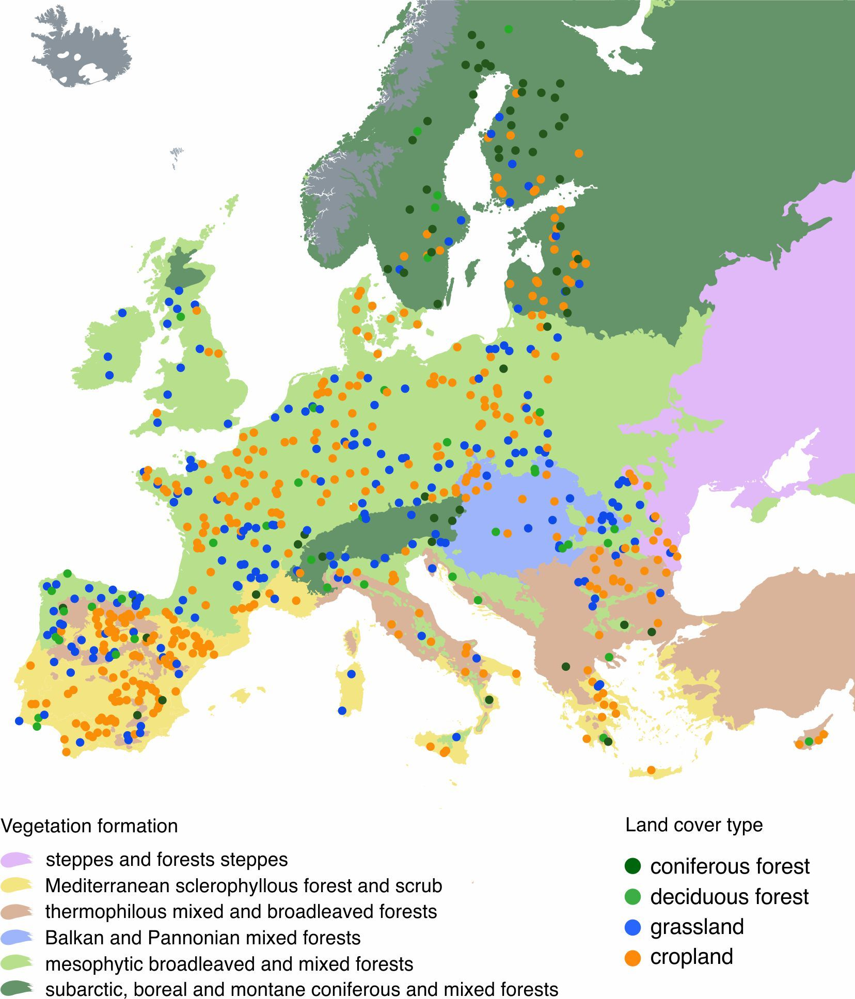

# Antibiotic-related microbial genetic machinery across pan-European soil metagenomes 

This repository houses the source code related to the study of antibiotic synthesis and resistance genes, obtained using high-throughput sequencing to analyze environmental DNA from 658 metagenomic samples of topsoil, collected from various regions across Europe.  

## Materials

The foundation for the study is based on the European Commission's [LUCAS Soil survey](https://esdac.jrc.ec.europa.eu/projects/lucas). 
These samples were uniformly collected across the European Union using a standardized protocol.  

Distribution of sampling sites across environments:  

  

## Repository structure

- **Main directory**: contains the [Snakemake](https://snakemake.readthedocs.io/en/stable/) workflow files and R-scripts  
- **`scripts` subdirectory**: contains auxiliary scripts utilized in the workflow  
- **`envs` subdirectory**: holds the specifications for [conda](https://docs.conda.io/en/latest/) environments  
- **`Singularity_Containers` subdirectory**: stores the [Singularity](https://sylabs.io/singularity/) container definition files  

